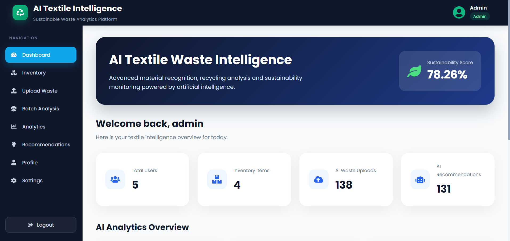
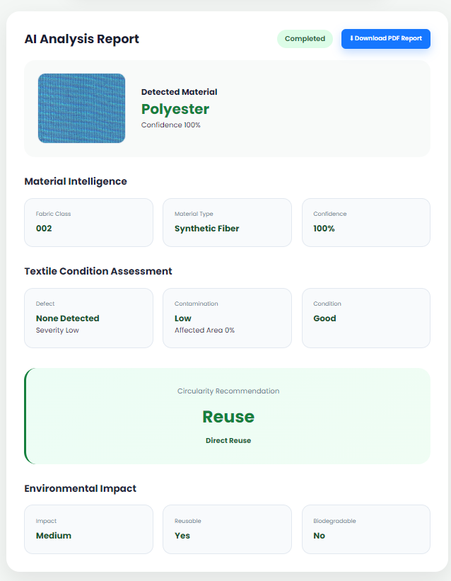
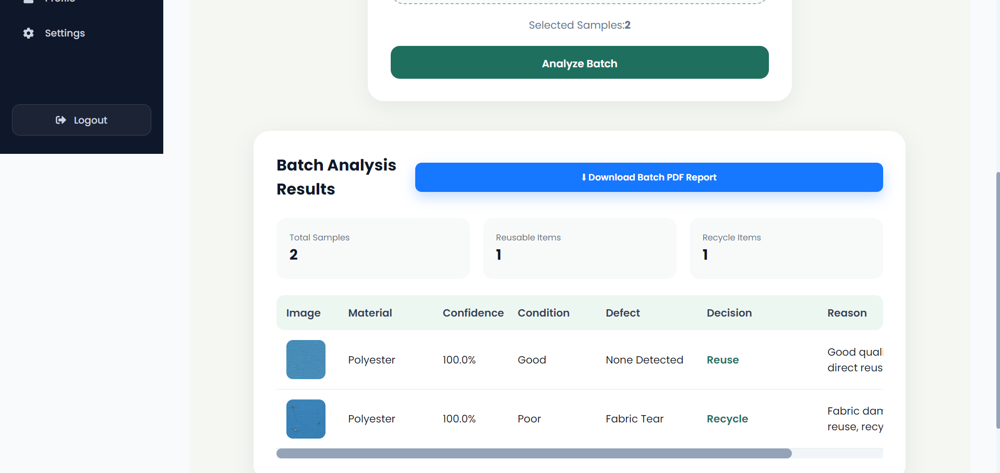
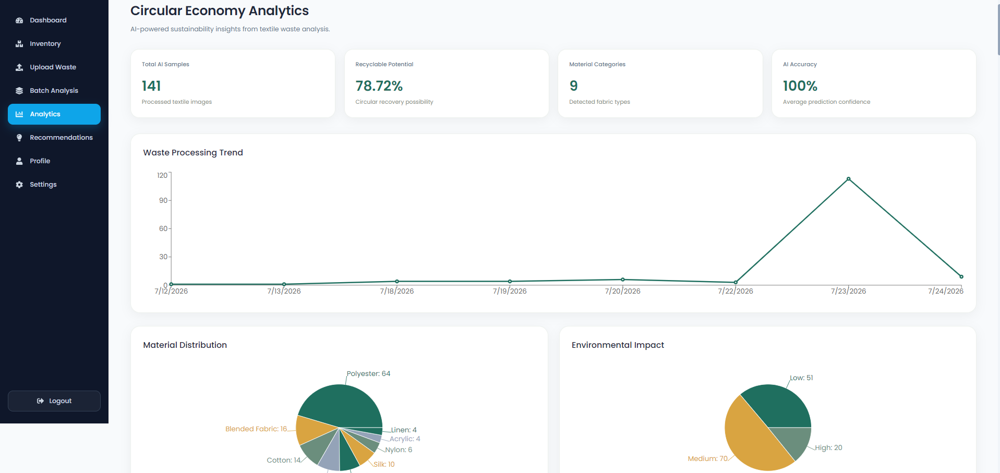
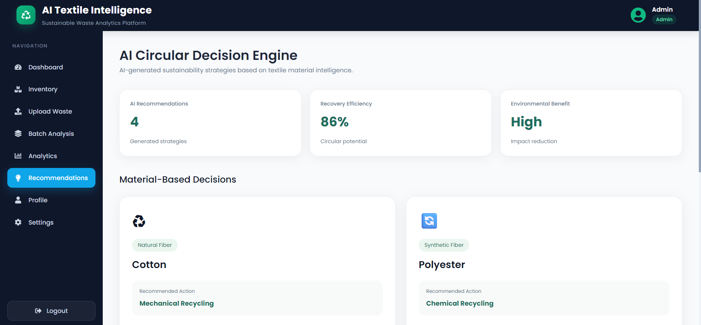
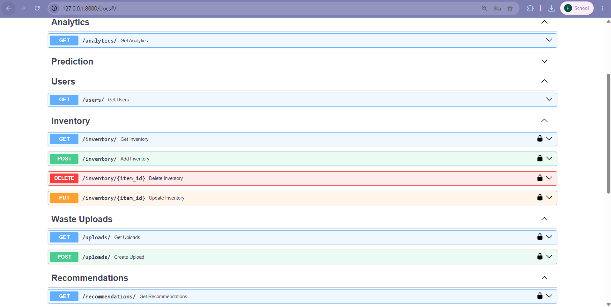

# AI Textile Waste Intelligence Platform

## Infosys Springboard Internship Project

### Individual Contribution - Sreevarshini-140


---

# Project Overview

The AI Textile Waste Intelligence Platform is a smart waste management system designed to analyze, classify, and manage textile waste using web technologies and AI-based solutions.

The platform enables textile industries, recyclers, NGOs, and administrators to manage textile inventory, upload waste information, and generate future AI-driven recommendations.

---

# Work Completed

# Frontend Development

- Set up frontend development environment using React and Vite.
- Created scalable application structure with reusable components.
- Implemented:
  - Navbar
  - Sidebar
  - Dashboard Cards
  - Tables
  - Layout components

## Developed Frontend Pages

- Login
- Dashboard
- Inventory
- Upload Waste
- Analytics
- Recommendations
- Profile
- Settings

## Frontend Features

- Implemented React Router navigation.
- Created protected routes.
- Designed responsive dashboard layout.
- Developed authentication workflow.
- Integrated application navigation structure.

---

# Backend Development

## FastAPI Backend Setup

- Created backend architecture using Python FastAPI.
- Configured backend dependencies and requirements.
- Implemented SQLAlchemy ORM integration.
- Connected backend with MySQL database.

---

# Database Implementation

Implemented database structure for:

- Users
- Textile Inventory
- Waste Uploads
- Recommendations

Created SQLAlchemy models for managing application data.

---

# Authentication and Security

Implemented secure JWT-based authentication system.

## Features

- User login authentication
- Password hashing using bcrypt
- Password verification
- JWT token generation
- OAuth2 password flow integration
- Protected backend APIs using Bearer token authentication

### Secured APIs

- Inventory APIs
- Waste Upload APIs
- Recommendation APIs

### Authentication Flow

```text
React Login Page
        |
        ↓
FastAPI Authentication API
        |
        ↓
User Verification
        |
        ↓
JWT Token Generation
        |
        ↓
Protected API Access
```

---

# AI / Machine Learning Development

# Milestone 1: Dataset Preparation and Exploratory Data Analysis

The Ten Fabrics Dataset (TFD) was selected for textile material recognition and classification.

## Dataset Details

- Dataset Name: Ten Fabrics Dataset (TFD)
- Dataset Type: Image Classification Dataset
- Total Images: 2969
- Number of Classes: 10
- Image Format: PNG
- Image Type: RGB Images

## Fabric Classes

```text
001
002
003
004
005
006
007
008
009
010
```

## Exploratory Data Analysis Completed

- Verified dataset folder structure
- Analyzed class distribution
- Checked image dimensions
- Verified missing values
- Checked duplicate images
- Prepared dataset for machine learning development

---

# Milestone 2: Material Recognition and Waste Classification

## Image Preprocessing Pipeline

Implemented an image preprocessing pipeline using TensorFlow.

### Completed Preprocessing Steps

- Loaded textile image dataset
- Converted images into RGB format
- Resized images to 224 × 224 pixels
- Normalized pixel values between 0 and 1
- Encoded fabric class labels
- Split dataset into training, validation, and testing sets
- Created TensorFlow data pipelines

## Dataset Split

| Dataset | Images |
|---------|--------|
| Training | 2078 |
| Validation | 445 |
| Testing | 446 |

## Preprocessing Configuration

```json
{
  "image_size": [224, 224],
  "normalization": "pixel values scaled between 0 and 1",
  "batch_size": 32
}
```

---

# CNN-Based Fabric Classification Model

Developed a Convolutional Neural Network (CNN) model for textile material recognition.

## Model Architecture

```text
Input Image
(224 × 224 × 3)

        ↓

Conv2D Layers

        ↓

Max Pooling Layers

        ↓

Feature Extraction

        ↓

Dense Classification Layer

        ↓

Softmax Output

        ↓

10 Fabric Classes
```

## Model Configuration

- Framework: TensorFlow / Keras
- Input Size: 224 × 224 RGB Images
- Number of Classes: 10
- Total Parameters: 11.17 Million
- Model Format: Keras (.keras)

---

# Model Performance Evaluation

The trained CNN model was evaluated using the unseen test dataset.

## Performance Results

| Metric | Score |
|--------|-------|
| Test Accuracy | 100% |
| Precision | 1.00 |
| Recall | 1.00 |
| F1-Score | 1.00 |
| Test Images Evaluated | 446 |

## Evaluation Methods

- Training accuracy and loss curves
- Classification report
- Confusion matrix analysis

The confusion matrix showed no misclassification between the ten fabric categories.

---

# Model Artifacts

Generated AI model files:

```text
models/

├── preprocessing_config.json
├── fabric_classifier.keras
└── fabric_classifier_best.keras
```

Large model files are managed using Git Large File Storage (Git LFS).

---

# AI Textile Intelligence Workflow

The platform follows an end-to-end AI-driven textile waste analysis pipeline.

```text
Textile Waste Image Upload

            ↓

CNN-Based Fabric Classification

            ↓

Material Identification

            ↓

Condition Assessment Layer

            ↓

Defect Detection + Contamination Analysis

            ↓

Circular Decision Engine

            ↓

Reuse / Repair / Recycling Recommendation
```

---

# Textile Condition Assessment

Material classification alone is not sufficient for deciding textile reuse or recycling.

The platform includes an additional inspection layer that evaluates textile quality using computer vision techniques.

## Condition Analysis Features

Implemented using OpenCV:

- Fabric damage detection
- Visible defect identification
- Contamination analysis
- Textile quality assessment

The inspection layer helps determine whether a textile sample should be:

- Reused directly
- Repaired / Upcycled
- Sent for recycling

---

# Defect Detection and Contamination Analysis

The computer vision module analyzes uploaded textile images and extracts:

- Defect regions
- Damage severity
- Contamination level
- Affected area percentage

### Example Output

| Parameter | Result |
|-----------|--------|
| Condition | Poor |
| Defect | Fabric Tear |
| Severity | High |
| Contamination | Low |
| Decision | Recycle |

---

# Batch Textile Analysis

The platform supports multiple textile image processing through batch analysis.

## Features

- Upload multiple textile samples
- Perform AI classification on each sample
- Generate condition reports
- Recommend reuse or recycling strategies

### Workflow

```text
Multiple Textile Images

        ↓

Batch Processing Engine

        ↓

AI Classification

        ↓

Condition Assessment

        ↓

Reuse / Recycle Segregation
```

---

# Circular Recommendation Engine

The recommendation engine combines:

- Predicted textile material
- Condition assessment
- Defect severity
- Contamination level

to generate sustainable waste management decisions.

### Decision Examples

| Condition | Defect | Recommendation |
|-----------|---------|----------------|
| Good | None Detected | Reuse |
| Fair | Minor Damage | Repair / Upcycle |
| Poor | Fabric Tear | Recycle |
| Poor | Heavy Contamination | Specialized Recycling |

---

# Platform Features

## User Management

- Secure Login
- JWT Authentication
- User Profiles
- Protected Routes
- Role-based Access

## Textile Inventory

- Add Inventory
- Update Inventory
- Delete Records
- Inventory Dashboard

## Waste Upload

- Upload Textile Images
- Material Classification
- Store Upload History

## AI Analysis

- Fabric Classification
- Defect Detection
- Contamination Analysis
- Condition Assessment

## Analytics Dashboard

- Waste Statistics
- Fabric Distribution
- Inventory Insights
- AI Prediction Reports

## Recommendation Engine

- Circular Economy Suggestions
- Reuse Recommendations
- Recycling Recommendations
- Repair Suggestions

---

# Application Screenshots

## Dashboard

```text
Project-screenshots/dashboard.png
```



---

## AI Textile Prediction

```text
Project-screenshots/single_prediction.png
```



---

## Batch Textile Analysis

```text
Project-screenshots/batch_analysis.png
```



---

## Analytics Dashboard

```text
Project-screenshots/analytics.png
```



---

## Recommendation Engine

```text
Project-screenshots/recommendations.png
```



---

## API Documentation

```text
Project-screenshots/api_docs.png
```



---

# Technology Stack

## Frontend

- React.js
- Vite
- JavaScript
- HTML5
- CSS3
- React Router

## Backend

- Python
- FastAPI
- SQLAlchemy
- MySQL
- JWT Authentication
- OAuth2

## AI / Machine Learning

- TensorFlow
- Keras
- OpenCV
- NumPy
- Pandas

## Development Tools

- Git
- GitHub
- Git LFS
- VS Code
- Postman

---

# Project Structure

```text
AI-Textile-Waste-Intelligence-Platform

│
├── frontend
│   ├── components
│   ├── pages
│   ├── services
│   ├── routes
│   └── assets
│
├── backend
│   ├── app
│   │   ├── api
│   │   ├── models
│   │   ├── database
│   │   ├── authentication
│   │   ├── ai
│   │   └── recommendation_engine
│   │
│   └── main.py
│
├── models
│   ├── preprocessing_config.json
│   ├── fabric_classifier.keras
│   └── fabric_classifier_best.keras
│
├── dataset
│
├── notebooks
│
├── Project-screenshots
│
├── requirements.txt
│
└── README.md
```

---

# Installation Guide

## Clone Repository

```bash
git clone https://github.com/springboardmentor802-dotcom/AI-Textile-Waste-Intelligence-Platform.git
```

```bash
cd AI-Textile-Waste-Intelligence-Platform
```

---

## Backend Setup

```bash
cd backend
```

Create virtual environment

```bash
python -m venv venv
```

Activate environment

### Windows

```bash
venv\Scripts\activate
```

### Linux / macOS

```bash
source venv/bin/activate
```

Install dependencies

```bash
pip install -r requirements.txt
```

Run FastAPI

```bash
uvicorn app.main:app --reload
```

---

## Frontend Setup

```bash
cd frontend
```

Install packages

```bash
npm install
```

Run application

```bash
npm run dev
```

---

# API Documentation

After running the backend:

Swagger UI

```text
http://localhost:8000/docs
```

ReDoc

```text
http://localhost:8000/redoc
```

---

# Future Enhancements

- Deep learning based textile defect segmentation
- Real-time camera-based textile inspection
- Mobile application for field inspection
- Advanced material composition detection
- Explainable AI (XAI) for prediction interpretation
- Cloud deployment using Docker and Kubernetes
- IoT integration for smart textile waste monitoring
- Large-scale recycling facility integration

---

# Learning Outcomes

During the Infosys Springboard Internship, the following skills were gained:

- React.js Frontend Development
- FastAPI Backend Development
- JWT Authentication
- SQLAlchemy ORM
- MySQL Database Design
- TensorFlow CNN Model Development
- OpenCV Image Processing
- Machine Learning Pipeline Development
- Computer Vision
- Git & GitHub Collaboration
- REST API Development
- AI Model Deployment Fundamentals

---

# Conclusion

The AI Textile Waste Intelligence Platform combines artificial intelligence, computer vision, and sustainable waste management practices to automate textile classification, quality assessment, and recycling decisions.

The platform integrates modern web technologies with deep learning models to create a scalable and intelligent textile waste management solution capable of assisting industries, recycling facilities, NGOs, and research organizations in adopting circular economy practices.

By combining CNN-based fabric recognition, computer vision inspection, secure backend services, and AI-powered recommendation engines, the project demonstrates how artificial intelligence can contribute to more sustainable textile waste management and environmental conservation.

---

# Author

**Prasangi Sree Varshini**

Infosys Springboard Internship Project

GitHub: https://github.com/Sreevarshini-140

---
