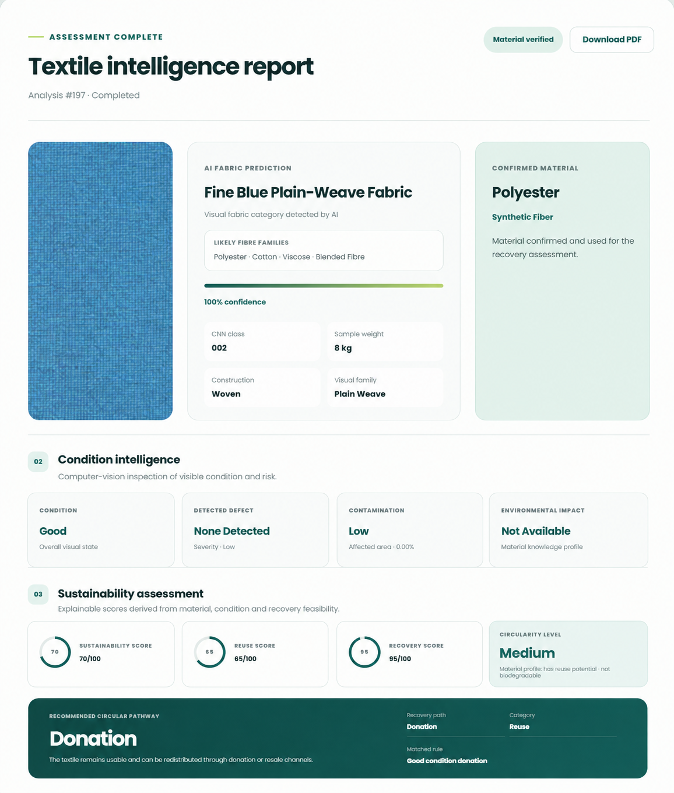
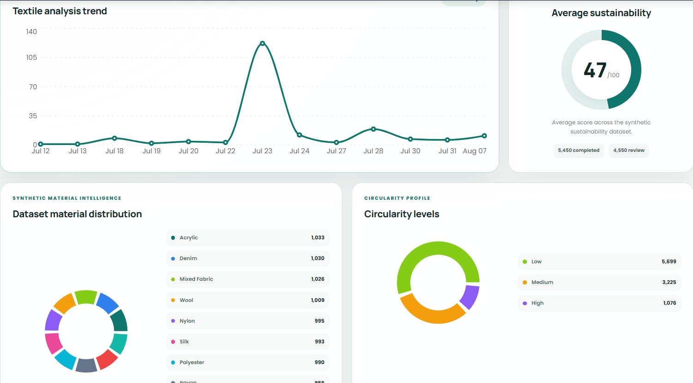
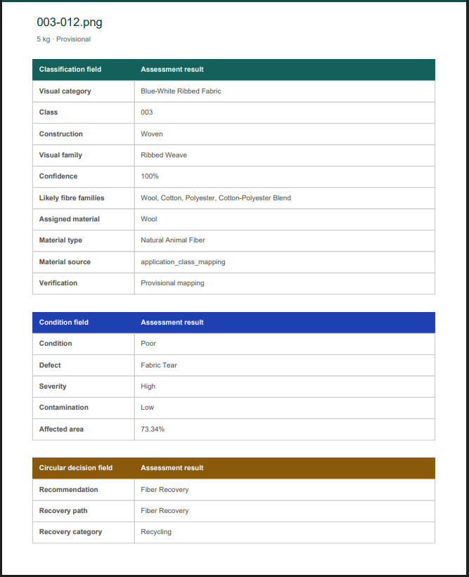

# AI Textile Waste Management System

## Infosys Springboard Internship Project

### Individual Contribution — Sreevarshini-140


---

# Project Overview

The **AI Textile Waste Management System** is an AI and computer-vision-based sustainable waste analytics platform designed to analyze textile waste and support explainable circular recovery decisions.

Traditional textile classification systems mainly identify the visual fabric category. However, material recognition alone is not sufficient to determine whether textile waste should be reused, repaired, donated, recycled, or subjected to specialized treatment.

This platform therefore combines:

* AI-based textile recognition
* Computer vision condition inspection
* Material verification
* Defect and contamination assessment
* Explainable rule-based recovery decisions
* Sustainability scoring
* Environmental impact estimation
* Role-based dashboards
* Inventory management
* Notifications
* Analytics
* PDF reporting

The complete workflow converts an uploaded textile image and its associated information into an **explainable recovery recommendation**.

---

# Problem Statement

Textile waste management involves more than identifying fabric types.

A textile item may visually belong to a particular fabric category, but its recovery pathway depends on several other factors including:

* Material
* Condition
* Defect severity
* Contamination
* Reuse potential
* Recovery feasibility

A classification-only system cannot reliably decide whether textile waste should be:

* Reused
* Donated
* Repaired
* Upcycled
* Mechanically recycled
* Chemically recycled
* Sent for fiber recovery
* Treated as specialized waste

Therefore, an intelligent waste-management platform needs to combine **AI evidence, computer vision inspection, verified textile information, sustainability assessment and explainable decision rules**.

---

# Project Objective

The objective of the project is to develop an intelligent textile waste management platform capable of:

1. Recognizing textile samples using deep learning.
2. Inspecting textile condition using computer vision.
3. Detecting defects and contamination.
4. Allowing material verification instead of blindly depending on AI predictions.
5. Generating explainable circular recovery recommendations.
6. Calculating sustainability, reuse and recovery scores.
7. Estimating environmental benefits.
8. Providing role-specific dashboards.
9. Securing features using authentication and role-based access control.
10. Providing analytics, inventory management, notifications and reports.

---

# Proposed Solution

The system follows a hybrid AI + rule-based architecture.

```text
User
  │
  ▼
React + Vite Frontend
  │
  ▼
FastAPI REST API
  │
  ├── Authentication + JWT
  │
  ├── Role-Based Access Control
  │
  ├── Inventory Management
  │
  ├── Notifications
  │
  ├── Analytics
  │
  └── Textile Analysis
  │
  ▼
AI / Intelligence Layer
  │
  ├── TensorFlow CNN
  │
  ├── OpenCV Condition Analysis
  │
  ├── Defect Detection
  │
  ├── Contamination Assessment
  │
  └── Material Verification
  │
  ▼
21-Rule Circular Decision Engine
  │
  ▼
Sustainability Assessment
  │
  ├── Sustainability Score
  ├── Reuse Score
  ├── Recovery Score
  └── Circularity Level
  │
  ▼
Environmental Impact Estimation
  │
  ├── CO₂ Saved
  ├── Water Saved
  ├── Energy Saved
  └── Landfill Diverted
  │
  ▼
Dashboard + Analytics + PDF Report
```

---

# Key Design Principle

The system does **not blindly use the CNN prediction as the final recovery decision**.

The AI model provides visual classification evidence.

The final recommendation is generated using additional verified and derived information such as:

* Verified material
* Condition
* Defect severity
* Contamination
* Reuse potential
* Recovery feasibility

This makes the final recommendation more explainable and suitable for practical textile waste management.

---

# Technology Stack

## Frontend

* React.js
* Vite
* JavaScript
* HTML5
* CSS3
* React Router
* Axios

## Backend

* Python
* FastAPI
* SQLAlchemy
* REST APIs
* JWT Authentication
* OAuth2
* bcrypt

## Database

* MySQL
* SQLAlchemy ORM

## Artificial Intelligence

* TensorFlow
* Keras
* Convolutional Neural Networks
* NumPy
* Pandas

## Computer Vision

* OpenCV

## Testing

* Python automated test scripts
* REST API validation
* Integration testing
* RBAC testing
* Model evaluation
* Performance testing

## Deployment / Containerization

* Docker
* Dockerfiles
* Nginx frontend configuration

## Development Tools

* Git
* GitHub
* Git LFS
* VS Code
* Postman
* Swagger UI

---

# Major System Modules

The platform is divided into the following major functional areas.

## 1. Authentication and User Management

Provides:

* Registration
* Login
* JWT authentication
* Password hashing
* Token-based API access
* User profile management
* Protected routes
* Role-based authorization

---

## 2. Textile Analysis

Provides:

* Textile image upload
* Weight input
* CNN-based textile classification
* Confidence information
* Material verification
* Upload history

---

## 3. Condition Intelligence

Uses OpenCV-based inspection to analyze:

* Textile condition
* Defect regions
* Visible damage
* Damage severity
* Contamination
* Quality indicators

---

## 4. Circular Decision Engine

Uses **21 verified decision rules** to generate explainable textile recovery pathways.

Possible recommendations include:

* Direct Reuse
* Donation
* Repair
* Upcycling
* Mechanical Recycling
* Chemical Recycling
* Fiber Recovery
* Material Separation
* Specialized Recycling
* Cleaning and Reassessment
* Manual Review
* Hazardous Textile Waste Treatment

---

## 5. Sustainability Intelligence

Calculates:

* Sustainability Score
* Reuse Score
* Recovery Score
* Circularity Level

Circularity is classified into:

* High Circularity
* Medium Circularity
* Low Circularity

---

## 6. Environmental Impact

The system estimates:

* CO₂ emissions saved
* Water saved
* Energy saved
* Landfill waste diverted

These values provide interpretable estimates of the environmental benefits of the recommended recovery pathway.

---

## 7. Analytics

Provides visualization and summaries for:

* Material distribution
* Textile condition
* Contamination
* Circularity level
* Recovery recommendations
* Sustainability scores
* Environmental impact
* Assessment status
* Textile analysis activity

---

## 8. Inventory Management

Supports:

* Inventory creation
* Inventory viewing
* Inventory updating
* Inventory deletion
* Batch information
* Textile material details
* Waste origin
* Condition grade
* Recovery potential
* Processing status
* Waste weight

Access to inventory actions is controlled using RBAC.

---

## 9. Notifications

Provides authenticated notification functionality for platform users.

Features include:

* User notifications
* Platform announcements
* Notification display
* Severity information
* Role-restricted announcement creation

---

## 10. Role-Based Dashboards

Dashboard information changes depending on the authenticated user's role.

Supported roles:

* Admin
* Industry
* Recycler
* NGO

Each role receives dashboard information relevant to its responsibilities.

---

# Milestone 1 — Dataset Preparation and Exploratory Data Analysis

The **Ten Fabrics Dataset (TFD)** was selected for textile material recognition.

## Dataset Details

| Property     | Value                |
| ------------ | -------------------- |
| Dataset      | Ten Fabrics Dataset  |
| Dataset Type | Image Classification |
| Total Images | 2,969                |
| Classes      | 10                   |
| Image Format | PNG                  |
| Image Type   | RGB                  |

## Fabric Classes

```text
001
002
003
004
005
006
007
008
009
010
```

## Exploratory Data Analysis

Completed:

* Dataset folder verification
* Class distribution analysis
* Image-dimension inspection
* Missing-value checks
* Duplicate-image checks
* Dataset preparation

---

# Milestone 2 — Material Recognition and Waste Classification

Milestone 2 introduced the deep-learning textile classification pipeline.

## Image Preprocessing

Implemented:

* Image loading
* RGB conversion
* Image resizing
* Pixel normalization
* Label encoding
* Train-validation-test splitting
* TensorFlow input pipelines

## Dataset Split

| Dataset    | Images |
| ---------- | -----: |
| Training   |  2,078 |
| Validation |    445 |
| Testing    |    446 |

## Preprocessing Configuration

```json
{
  "image_size": [224, 224],
  "normalization": "pixel values scaled between 0 and 1",
  "batch_size": 32
}
```

---

# CNN Fabric Classification Model

A Convolutional Neural Network was developed for textile material recognition.

## Architecture

```text
Input Image
224 × 224 × 3
      │
      ▼
Conv2D Layers
      │
      ▼
Max Pooling
      │
      ▼
Feature Extraction
      │
      ▼
Dense Layer
      │
      ▼
Softmax Output
      │
      ▼
10 Fabric Classes
```

## Model Configuration

| Parameter    | Value                       |
| ------------ | --------------------------- |
| Framework    | TensorFlow / Keras          |
| Input        | 224 × 224 RGB               |
| Classes      | 10                          |
| Parameters   | Approximately 11.17 Million |
| Model Format | `.keras`                    |

---

# Model Evaluation

The trained CNN model was evaluated using the held-out test dataset.

## Recorded Evaluation

| Metric        | Result |
| ------------- | -----: |
| Test Accuracy |   100% |
| Precision     |   1.00 |
| Recall        |   1.00 |
| F1 Score      |   1.00 |
| Test Images   |    446 |

Evaluation included:

* Accuracy measurement
* Classification report
* Confusion matrix
* Prediction analysis

> The recorded evaluation corresponds to the prepared project dataset and test split and should not automatically be interpreted as general real-world performance.

---

# Model Artifacts

```text
models/
├── preprocessing_config.json
├── fabric_classifier.keras
└── fabric_classifier_best.keras
```

Large model files can be managed separately using Git LFS where required.

---

# Milestone 3 — Explainable Sustainability Intelligence

Milestone 3 extended the project beyond visual material recognition.

It introduced:

* Computer vision inspection
* Explainable recovery recommendations
* Sustainability assessment
* Circularity analysis
* Environmental impact estimation
* Analytics
* Batch analysis
* PDF reporting

---

# Milestone 3 End-to-End Workflow

```text
Textile Image Upload
        │
        ▼
CNN Fabric Classification
        │
        ▼
Material Verification
        │
        ▼
OpenCV Inspection
        │
        ▼
Condition Assessment
        │
        ▼
Defect Detection
        │
        ▼
Contamination Analysis
        │
        ▼
21-Rule Decision Engine
        │
        ▼
Recovery Recommendation
        │
        ▼
Sustainability Assessment
        │
        ▼
Environmental Impact
        │
        ▼
Analytics / Report
```

---

# Condition Assessment

Material recognition alone cannot determine textile usability.

The computer vision layer evaluates:

* Fabric condition
* Visible damage
* Defect regions
* Damage severity
* Contamination
* Affected-area characteristics

Example:

| Parameter     | Example Result |
| ------------- | -------------- |
| Condition     | Poor           |
| Defect        | Fabric Tear    |
| Severity      | High           |
| Contamination | Low            |
| Recovery      | Recycle        |

---

# Explainable Recommendation Engine

The recommendation engine contains **21 verified decision rules**.

The engine considers:

```text
Material
   +
Condition
   +
Damage Severity
   +
Contamination
   +
Reuse Potential
        │
        ▼
Explainable Recovery Recommendation
```

Unlike a black-box recommendation, the selected recovery pathway can be associated with the matching decision logic.

---

# Sustainability Assessment

Every analyzed textile can receive three main scores.

## Sustainability Score

Represents overall sustainability suitability based on factors such as:

* Material
* Condition
* Damage
* Contamination
* Recovery feasibility

## Reuse Score

Represents the textile's direct reuse potential.

## Recovery Score

Represents suitability for recycling or material recovery.

---

# Synthetic Sustainability Dataset

A synthetic dataset containing **10,000 textile sustainability assessment records** was generated to support large-scale analytics and visualization.

The dataset includes fields such as:

* Material
* Condition
* Damage level
* Contamination
* Recommendation
* Sustainability score
* Reuse score
* Recovery score
* Circularity
* CO₂ saved
* Water saved
* Energy saved
* Landfill diverted

The synthetic records are used for analytics and visualization rather than being presented as real-world collected textile records.

---

# Analytics Dashboard

The analytics module visualizes:

* Sustainability score distribution
* Material distribution
* Condition distribution
* Contamination distribution
* Circularity levels
* Recovery recommendation distribution
* Environmental benefits
* Textile portfolio statistics
* Recent analyses

---

# Batch Textile Analysis

The project includes functionality designed for processing multiple textile samples.

The batch workflow supports:

* Multiple textile inputs
* Individual analysis
* Recovery recommendations
* Sustainability assessment
* Environmental impact estimation
* Individual reports
* Batch-level summaries

---

# PDF Reporting

The textile analysis workflow can generate assessment reports containing information such as:

* AI prediction
* Verified material
* Condition
* Defect analysis
* Contamination
* Recovery recommendation
* Sustainability scores
* Environmental impact
* Circular recovery pathway

---

# Milestone 3 Achievements

* CNN-based fabric classification
* OpenCV textile inspection
* Condition assessment
* Defect detection
* Contamination analysis
* 21-rule recovery engine
* Explainable recommendations
* Sustainability scoring
* Reuse scoring
* Recovery scoring
* Circularity classification
* Environmental impact estimation
* 10,000-record synthetic analytics dataset
* Analytics dashboard
* Batch analysis workflow
* PDF assessment reporting

---

# Milestone 4 — Final Integration, RBAC, Testing and Containerization

Milestone 4 focused on transforming the individual AI modules into a more complete multi-user application.

Major M4 work included:

* User registration
* Role-Based Access Control
* Role-specific dashboards
* Notifications
* API protection
* Frontend route protection
* Backend authorization
* Integration testing
* RBAC validation
* API testing
* Model evaluation utilities
* Performance-testing utilities
* Docker configuration
* Final frontend-backend integration

---

# User Registration

A registration workflow was added to the frontend and authentication backend.

The registration interface allows new application users to create accounts that can subsequently authenticate through the existing JWT-based authentication flow.

```text
Register
   │
   ▼
Backend Validation
   │
   ▼
User Creation
   │
   ▼
Login
   │
   ▼
JWT Token
   │
   ▼
Protected Application
```

---

# Role-Based Access Control

The system implements role-specific authorization.

Supported roles:

```text
Admin
Industry
Recycler
NGO
```

Authentication answers:

> **Who is the user?**

RBAC answers:

> **What is this user allowed to do?**

---

# RBAC Architecture

```text
User Login
    │
    ▼
JWT Token
    │
    ▼
Authentication Dependency
    │
    ▼
Extract User + Role
    │
    ▼
Role Dependency
    │
    ├── Allowed → Execute API
    │
    └── Blocked → HTTP 403
```

Authorization is enforced at both:

* Frontend navigation / protected routes
* Backend APIs

Backend enforcement ensures that restricted operations cannot be bypassed simply by calling an API directly.

---

# RBAC Permission Examples

## Inventory Viewing

Authenticated users can access authorized inventory information.

## Inventory Creation

Configured access:

| Role     | Create Inventory |
| -------- | ---------------- |
| Admin    | Allowed          |
| Industry | Allowed          |
| Recycler | Restricted       |
| NGO      | Restricted       |

## Inventory Update

| Role     | Update Inventory |
| -------- | ---------------- |
| Admin    | Allowed          |
| Industry | Allowed          |
| Recycler | Restricted       |
| NGO      | Restricted       |

## Inventory Delete

Deletion is restricted to authorized administrative operations.

## Platform Announcements

Administrative announcement creation is restricted to the Admin role.

---

# Role-Based Dashboards

The backend provides dashboard information based on the authenticated user's role.

## Admin

Designed for overall platform monitoring and administrative visibility.

Typical information includes:

* Platform activity
* User information
* Textile analysis statistics
* Inventory indicators
* Sustainability information

## Industry

Designed around manufacturing / textile-waste generation activity.

The dashboard can focus on information associated with the authenticated industry's textile analysis activity.

## Recycler

Designed to provide recycling and recovery-oriented operational intelligence.

## NGO

Designed to provide sustainability-oriented platform information and analytics.

---

# Notifications

Milestone 4 introduced a notification subsystem.

Backend components include:

```text
notification.py
notifications.py
notification_service.py
```

Frontend components include:

```text
Notifications.jsx
Notifications.css
notificationService.js
```

The notification workflow allows authenticated users to retrieve notifications, while privileged administrative actions such as platform announcements are authorization-controlled.

---

# M4 Testing Strategy

Several dedicated validation scripts were created.

```text
backend/
├── m4_api_tests.py
├── m4_integration_tests.py
├── m4_model_evaluation.py
├── m4_performance_tests.py
├── m4_role_tests.py
├── test_rbac.py
└── cleanup_performance_records.py
```

Testing was organized across multiple levels rather than relying on only manual browser testing.

---

# Role-Based Access Tests

RBAC tests validate operations including:

* Authentication for all supported roles
* Inventory access
* Inventory creation permissions
* Inventory update permissions
* Inventory delete permissions
* Notification access
* Administrative announcements
* Restricted-route rejection

The automated RBAC script compares actual HTTP responses against expected status codes.

Examples:

```text
Allowed request       → HTTP 200
Unauthorized role     → HTTP 403
```

Temporary records created during testing are cleaned up after validation.

---

# Integration Testing

Integration testing checks communication between major application layers.

```text
Frontend / Client Request
        │
        ▼
FastAPI Endpoint
        │
        ▼
Authentication / RBAC
        │
        ▼
Service Logic
        │
        ▼
Database / AI Processing
        │
        ▼
API Response
```

The objective is to verify that components work together as a complete system rather than only passing isolated unit-level checks.

---

# API Testing

API-level testing covers core backend endpoints and verifies:

* Expected HTTP responses
* Authentication behavior
* Request validation
* Authorization restrictions
* Integration between routes and backend services

---

# Model Evaluation Validation

Milestone 4 includes dedicated model-evaluation utilities and generated validation artifacts.

```text
backend/validation/model_evaluation/
├── classification_report.txt
├── confusion_matrix.csv
├── evaluation_sample_manifest.csv
├── model_evaluation_summary.json
└── prediction_results.csv
```

These artifacts provide structured evidence of model validation.

---

# Performance Testing

Performance testing utilities were added to examine backend endpoint response behavior.

The goal is to identify:

* Unexpected latency
* API bottlenecks
* Slow database operations
* Integration overhead

Performance scripts can generate temporary application records when required and remove those records afterward using the cleanup utility.

---

# Docker Containerization

Docker support was introduced to make the application environment more reproducible and easier to prepare for deployment.

Project container files include:

```text
.dockerignore

backend/
├── Dockerfile
└── requirements-docker.txt

frontend/
├── Dockerfile
└── nginx.conf
```

---

# Backend Docker Architecture

The backend container uses a Python environment for FastAPI.

Simplified workflow:

```text
Python Base Image
      │
      ▼
Install System Dependencies
      │
      ▼
Install Python Requirements
      │
      ▼
Copy FastAPI Backend
      │
      ▼
Load Application Components
      │
      ▼
Run Uvicorn
      │
      ▼
Port 8000
```

---

# Frontend Container

The frontend Docker configuration prepares the React application for container-based serving.

Nginx configuration is included for serving the built frontend application.

---

# Docker Ignore Configuration

The root `.dockerignore` excludes unnecessary or sensitive development files such as:

```text
.git
Python virtual environments
Python caches
.env files
node_modules
build output
temporary uploads
pytest cache
datasets
notebooks
IDE metadata
```

This keeps the Docker build context smaller and prevents local development artifacts from being unnecessarily copied into images.

---

# Milestone 4 Achievements

* Registration workflow
* JWT authentication integration
* Role-Based Access Control
* Admin role support
* Industry role support
* Recycler role support
* NGO role support
* Protected frontend routes
* Backend role enforcement
* Role-specific dashboards
* Notification system
* Administrative announcements
* Inventory permission enforcement
* API testing utilities
* Integration testing
* RBAC testing
* Model-evaluation validation
* Performance-test utilities
* Docker backend configuration
* Docker frontend configuration
* Nginx configuration
* Final frontend/backend integration

---

# Complete Project Workflow

```text
User Registration / Login
          │
          ▼
JWT Authentication
          │
          ▼
Role Identification
          │
          ▼
Role-Based Dashboard
          │
          ▼
Upload Textile Image + Weight
          │
          ▼
CNN Material Recognition
          │
          ▼
Material Verification
          │
          ▼
OpenCV Condition Inspection
          │
          ├── Defect Detection
          ├── Damage Severity
          └── Contamination
          │
          ▼
21-Rule Decision Engine
          │
          ▼
Recovery Recommendation
          │
          ▼
Sustainability Assessment
          │
          ├── Sustainability Score
          ├── Reuse Score
          ├── Recovery Score
          └── Circularity Level
          │
          ▼
Environmental Impact
          │
          ├── CO₂ Saved
          ├── Water Saved
          ├── Energy Saved
          └── Landfill Diverted
          │
          ▼
Database Storage
          │
          ├───────────────┬───────────────┐
          ▼               ▼               ▼
      Dashboard       Analytics        Reports
          │
          ▼
    Notifications
```

---

# Application Pages

The frontend includes pages for:

* Login
* Registration
* Dashboard
* Inventory
* Upload Waste
* Batch Analysis
* Analytics
* Recommendations
* Notifications
* Profile

---

# Application Screenshots

Screenshots are stored inside the project screenshot directory where available.

---

## Dashboard

The dashboard provides a consolidated overview of textile-analysis activity, sustainability information, circular recovery outcomes and other role-relevant information.

```text
Project-screenshots/dashboard.png
```


---

## Upload Waste

The Upload Waste page allows the user to provide:

* Textile image
* Measured weight

The request then enters the AI + computer vision assessment workflow.

```text
Project-screenshots/upload_waste.png
```



---

## Batch Analysis

```text
Project-screenshots/batch_analysis.png
```


---

## Analytics

```text
Project-screenshots/analytics.png
```


---

## Analytics Graphs

```text
Project-screenshots/analytics_graphs.png
```



---

## Recommendations

```text
Project-screenshots/recommendations.png
```


---

## PDF Report

```text
Project-screenshots/pdf_report.png
```



---

## API Documentation

```text
Project-screenshots/api_docs.png
```


---

# Backend API Areas

The application exposes APIs covering major functional areas such as:

```text
/auth
/inventory
/prediction
/analytics
/dashboard
/notifications
/users
```

Exact operations are documented through the FastAPI Swagger interface.

---

# Authentication Flow

```text
React Login
    │
    ▼
POST /auth/login
    │
    ▼
Validate Credentials
    │
    ▼
Password Verification
    │
    ▼
Generate JWT
    │
    ▼
Frontend Stores Token
    │
    ▼
Authorization: Bearer <token>
    │
    ▼
Protected FastAPI Endpoint
```

---

# Project Structure

```text
AI-Textile-Waste-Intelligence-Platform/
│
├── backend/
│   │
│   ├── app/
│   │   ├── api/
│   │   │   ├── analytics.py
│   │   │   ├── dashboard.py
│   │   │   └── prediction.py
│   │   │
│   │   ├── models/
│   │   │   ├── user.py
│   │   │   ├── notification.py
│   │   │   └── ...
│   │   │
│   │   ├── routes/
│   │   │   ├── auth.py
│   │   │   ├── inventory.py
│   │   │   ├── notifications.py
│   │   │   ├── users.py
│   │   │   └── ...
│   │   │
│   │   ├── schemas/
│   │   ├── services/
│   │   ├── utils/
│   │   ├── database.py
│   │   └── main.py
│   │
│   ├── validation/
│   │   └── model_evaluation/
│   │
│   ├── m4_api_tests.py
│   ├── m4_integration_tests.py
│   ├── m4_model_evaluation.py
│   ├── m4_performance_tests.py
│   ├── m4_role_tests.py
│   ├── test_rbac.py
│   ├── cleanup_performance_records.py
│   ├── requirements-docker.txt
│   └── Dockerfile
│
├── frontend/
│   │
│   ├── src/
│   │   ├── api/
│   │   ├── components/
│   │   ├── pages/
│   │   │   ├── Analytics/
│   │   │   ├── Dashboard/
│   │   │   ├── Login/
│   │   │   ├── Notifications/
│   │   │   ├── Register/
│   │   │   └── ...
│   │   │
│   │   ├── routes/
│   │   ├── services/
│   │   └── utils/
│   │
│   ├── Dockerfile
│   └── nginx.conf
│
├── models/
│   ├── preprocessing_config.json
│   ├── fabric_classifier.keras
│   └── fabric_classifier_best.keras
│
├── datasets/
│
├── notebooks/
│
├── Project-screenshots/
│
├── .dockerignore
├── requirements.txt
└── README.md
```

---

# Installation Guide

## 1. Clone the Repository

```bash
git clone https://github.com/springboardmentor802-dotcom/AI-Textile-Waste-Intelligence-Platform.git
```

Enter the project directory:

```bash
cd AI-Textile-Waste-Intelligence-Platform
```

If working specifically with the project branch:

```bash
git checkout Sreevarshini-140
```

---

# Backend Setup

Move into the backend folder:

```bash
cd backend
```

Create a virtual environment:

```bash
python -m venv venv
```

## Windows

Activate:

```bash
venv\Scripts\activate
```

## Linux / macOS

```bash
source venv/bin/activate
```

Install backend dependencies:

```bash
pip install -r requirements.txt
```

If the repository uses the root requirements file instead, install from the appropriate path for the local project configuration.

---

# Environment Configuration

Create the backend environment file required by the application.

Example structure:

```env
DATABASE_URL=your_database_connection_string
SECRET_KEY=your_secret_key
ALGORITHM=HS256
ACCESS_TOKEN_EXPIRE_MINUTES=30
```

Do **not** commit real passwords, database credentials or secret keys to GitHub.

---

# Run Backend

From the backend directory:

```bash
uvicorn app.main:app --reload
```

The backend should then be available at:

```text
http://127.0.0.1:8000
```

---

# API Documentation

Swagger UI:

```text
http://127.0.0.1:8000/docs
```

ReDoc:

```text
http://127.0.0.1:8000/redoc
```

---

# Frontend Setup

Open another terminal.

Move into the frontend directory:

```bash
cd frontend
```

Install dependencies:

```bash
npm install
```

Start the Vite development server:

```bash
npm run dev
```

The frontend will display the local URL generated by Vite.

---

# Local Development Flow

Recommended startup order:

```text
1. Start MySQL / Database
          │
          ▼
2. Activate Python Environment
          │
          ▼
3. Start FastAPI Backend
          │
          ▼
4. Start React Frontend
          │
          ▼
5. Open Application
```

---

# Running M4 Validation Scripts

Start the backend before executing API-based validation scripts.

Examples:

```bash
python m4_api_tests.py
```

```bash
python m4_role_tests.py
```

```bash
python m4_integration_tests.py
```

```bash
python m4_performance_tests.py
```

```bash
python m4_model_evaluation.py
```

RBAC tests depend on the configured test accounts and application database state.

---

# Docker Setup

Docker configuration has been added for the frontend and backend.

## Backend

```text
backend/Dockerfile
```

## Frontend

```text
frontend/Dockerfile
```

## Frontend Server

```text
frontend/nginx.conf
```

## Docker Requirements

```text
backend/requirements-docker.txt
```

The current Docker configuration provides the foundation for containerized execution and production deployment preparation.

---

# Security Features

The application includes:

* JWT token authentication
* Password hashing
* Password verification
* OAuth2 integration
* Protected routes
* Backend authorization
* Role-based access control
* Restricted administrative endpoints
* Environment-variable configuration
* `.env` exclusion from Docker context / Git workflows where configured

---

# Validation and Reliability

The project uses several layers of validation.

## Input Validation

Examples include checking:

* Image format
* Image validity
* Weight input
* Upload identifiers
* Material information

## Authentication Validation

Restricted APIs require valid authentication.

## Authorization Validation

RBAC verifies that the authenticated role is permitted to execute the requested action.

## AI Validation

Model-evaluation artifacts provide classification and prediction evidence.

## Integration Validation

Integration scripts evaluate interaction across multiple application components.

## Performance Validation

Performance utilities evaluate backend response behavior.

---

# Project Development Milestones

| Milestone   | Main Focus                                                       |
| ----------- | ---------------------------------------------------------------- |
| Milestone 1 | Dataset Preparation and EDA                                      |
| Milestone 2 | CNN Material Recognition                                         |
| Milestone 3 | Condition Intelligence, Recommendation Engine and Sustainability |
| Milestone 4 | RBAC, Dashboards, Notifications, Testing, Integration and Docker |

---

# Major Project Achievements

The final project combines:

* Full-stack web development
* Deep learning
* Computer vision
* Database management
* Authentication
* RBAC
* Explainable decision logic
* Sustainability analytics
* REST APIs
* Automated validation
* Performance testing
* Containerization

The platform demonstrates a complete flow from user authentication to textile analysis and explainable recovery guidance.

---

# Challenges and Solutions

## 1. Material Classification Alone Was Insufficient

### Challenge

The AI model could recognize visual textile classes but could not independently determine the best recovery pathway.

### Solution

A condition-analysis layer and explainable rule-based recommendation engine were added.

---

## 2. Textile Condition Needed Separate Inspection

### Challenge

Two samples of similar material may require different treatment due to condition, defects or contamination.

### Solution

OpenCV-based textile inspection was integrated.

---

## 3. Limited Large-Scale Sustainability Data

### Challenge

A sufficiently large real textile sustainability dataset was not available for analytics development.

### Solution

A **10,000-record synthetic sustainability dataset** was generated for analytics and visualization.

Synthetic data is kept conceptually separate from real user-generated textile records.

---

## 4. Different Users Required Different Permissions

### Challenge

Industry users, recyclers, NGOs and administrators should not have identical privileges.

### Solution

A role-based access control system was implemented at the frontend and backend.

---

## 5. Final System Required Cross-Module Validation

### Challenge

Individual features can work independently while integration errors still exist.

### Solution

Dedicated M4 API, integration, RBAC, model-evaluation and performance validation scripts were introduced.

---

## 6. Environment Reproducibility

### Challenge

Local setup can differ across development environments.

### Solution

Dockerfiles, Docker-specific requirements and Nginx configuration were added as a containerization foundation.

---

# Future Enhancements

Possible future improvements include:

* Deep-learning textile defect segmentation
* Advanced fiber-composition recognition
* Real-time camera inspection
* Mobile application
* Explainable AI visualization for CNN predictions
* Improved batch-processing reliability and UX
* More diverse real-world textile datasets
* Production-grade cloud deployment
* Kubernetes orchestration
* CI/CD pipelines
* Object-storage integration
* Advanced monitoring and logging
* IoT textile-waste collection integration
* Recycling-facility integration
* Real-time sustainability benchmarking

---

# Learning Outcomes

The project provided practical experience in:

* React.js development
* Vite
* FastAPI
* REST API development
* SQLAlchemy ORM
* MySQL
* JWT authentication
* OAuth2
* Role-Based Access Control
* TensorFlow
* Keras
* Convolutional Neural Networks
* OpenCV
* Computer vision
* Dataset preprocessing
* AI model evaluation
* Explainable rule-based systems
* Sustainability analytics
* Automated API testing
* Integration testing
* Performance testing
* Docker fundamentals
* Git
* GitHub
* Full-stack AI application development

---

# Conclusion

The **AI Textile Waste Management System** demonstrates how artificial intelligence, computer vision, explainable decision logic and modern full-stack technologies can be combined to support sustainable textile waste management.

The project goes beyond simple image classification.

It performs a complete textile intelligence workflow involving:

```text
Recognition
     +
Verification
     +
Condition Analysis
     +
Recovery Decision
     +
Sustainability Assessment
     +
Environmental Impact
```

The addition of JWT authentication, role-based access control, role-specific dashboards, notifications, automated testing and Docker configuration transforms the AI workflow into a more complete software platform.

The final system demonstrates how AI-assisted textile analysis can support more transparent and sustainable circular-economy decisions for industries, recyclers, NGOs and administrators.

---

# Repository

```text
https://github.com/springboardmentor802-dotcom/AI-Textile-Waste-Intelligence-Platform
```

Project branch:

```text
Sreevarshini-140
```

---

# Author

**Prasangi Sree Varshini**

Infosys Springboard Internship Project

GitHub:

```text
https://github.com/Sreevarshini-140
```

---

## Project Status

**Milestone 1 — Completed**

**Milestone 2 — Completed**

**Milestone 3 — Completed**

**Milestone 4 — Completed**

**Final Integration — Completed**
